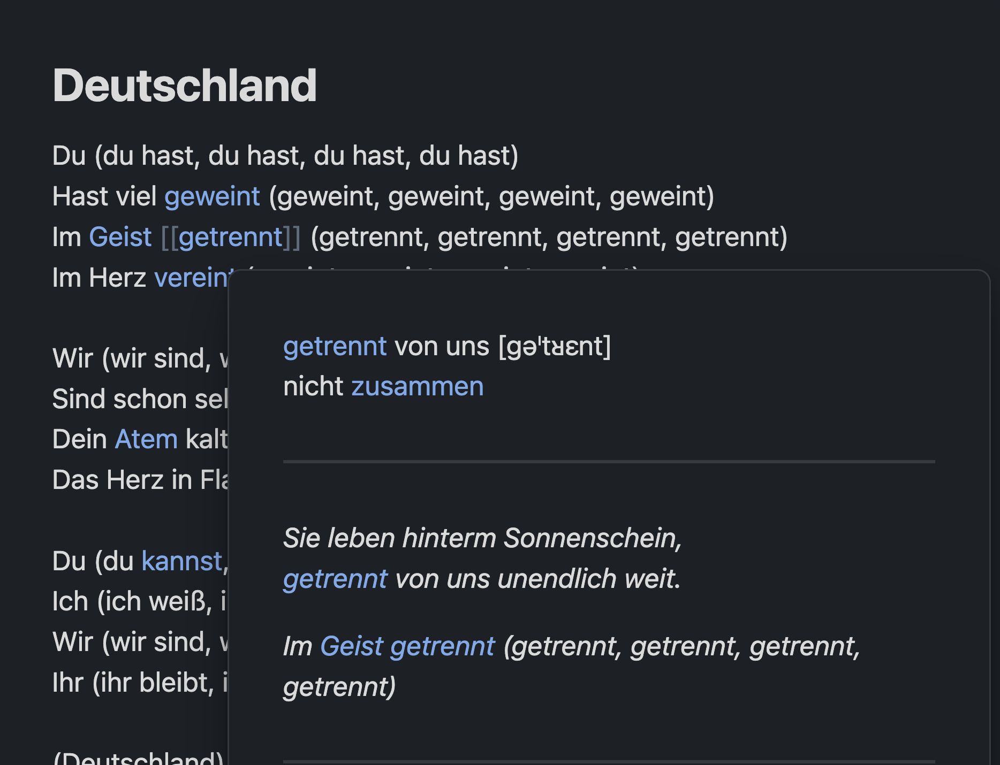

# Read german texts. Collect contexts for unknown words. Build passive vocabulary.

Open a file with a German text.

For every unknown word, generate a structured vocabulary entry. 

Add context from the text.

Enjoy the ever-growing web of your personal dictionary.

This is simpy an Obsidian Vault with tutorial for [this plugin](https://github.com/clockblocker/filler-de)

Requirements:
- Installed [Obsidian](https://obsidian.md/)
- [Antropic API Key](https://www.merge.dev/blog/anthropic-api-key)

## Key Features

### 1. Structured Entry Templates
Each word type has a specialized template that includes:
- Pronunciation
- Conjugation/declension tables
- Synonyms and antonyms
- Translation
- Morphological breakdown
- Part of speech tagging

### 2. Automatic Backlink Management
The plugin automatically maintains bidirectional links between related words, helping you build a network of connected vocabulary:
- Links between base verbs and their prefixed forms
- Connections between synonyms and antonyms
- References between related grammatical forms

## Usage

1. Create a new note in your vault
2. Open the command palette (Cmd/Ctrl + P)
3. Choose the appropriate template for your word type
4. Fill in the basic information - the plugin will handle the formatting and linking
